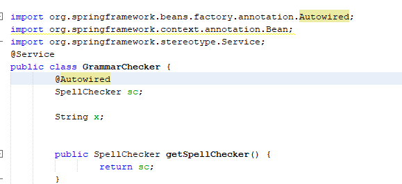
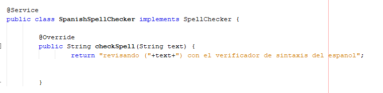
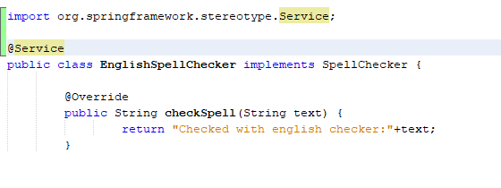

# Lab3Arsw

# Autores:
* Andres Rodriguez del toro
* Nicolas Patiño
---
# Introduction to Spring and Configuration using annotations

# Part I - Basic workshop

 configuracion de spellcheker
 

configuracion de spellspanish

test 

# Part II

### Blueprint Management 1
# Part I
Configure the application to work under a dependency injection scheme, as shown in the previous diagram.
The above requires:
* ***1.*** Add the dependencies of Spring. Add the Spring settings. Configure the application - by means of annotations - so that the persistence scheme is injected when the BlueprintServices bean is created. Complete the getBluePrint() and getBlueprintsByAuthor() operations. Implement everything required from the lower layers (for now, the available persistence scheme InMemoryBlueprintPersistence) by adding the corresponding tests in InMemoryPersistenceTest.
* ***2.*** 
* ***3.***
* ***4.***
